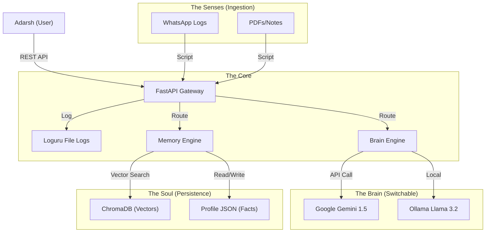

# PROJECT JARVIS: OPERATION NEW YEAR (2026)

**Mission:** Build a scalable, memory-persistent, learning AI companion ("The Kid") by Jan 1, 2026.
**Operator:** Adarsh
**Status:** ACTIVE

## 1. The Philosophy: "The Kid" Architecture

We are not building a chatbot. We are building a Digital Entity with three components:

*   **The Brain (Stateless Processor):** It thinks, reasons, and speaks. (Gemini 1.5 Flash / Llama 3.2).
*   **The Soul (Stateful Memory):** It remembers facts, vibes, and history. (ChromaDB + SQLite).
*   **The Hands (Tools):** It executes actions. (Python Scripts).

## 2. The Tech Stack (The "Reliable" Suite)

*   **Core Backend:** Python 3.11+ with FastAPI. (Industry standard, Async, Type-safe).
*   **Brain:** Google Gemini 1.5 Flash (Free, 1M context window, Fast).
*   **Backup:** Ollama (Local Llama 3.2) for privacy/offline.
*   **Long-Term Memory:** ChromaDB. (Runs locally, no docker needed initially, scales well).
*   **Logging:** Loguru. (Better than Python logging, structured, auto-rotating).
*   **Validation:** Pydantic. (Data integrity is non-negotiable).

## 3. Weekly Sprint Schedule (38 Days Remaining)

### 🟢 Week 1: The Skeleton & The Brain (Nov 24 - Nov 30)
**Goal:** A running API that can "Think" and "Log".

*   [ ] Setup Git Repo & Virtual Env.
*   [ ] Build FastAPI Skeleton (Middleware, CORS, Error Handling).
*   [ ] Integrate Gemini API.
*   [ ] Setup Loguru to capture every request/error to a file.
*   [ ] **Milestone:** You send a curl request, it replies "Hello Adarsh", and a log file is created.

### 🟡 Week 2: The Hippocampus (Memory) (Dec 1 - Dec 7)
**Goal:** It remembers what you told it 5 minutes ago.

*   [ ] Install ChromaDB.
*   [ ] Build `/ingest` endpoint: Takes text/JSON and saves it as vectors.
*   [ ] Build RAG Logic: Before answering, search ChromaDB for relevant context.
*   [ ] **Milestone:** Tell it "My favorite color is Blue". Restart server. Ask "What is my favorite color?", and it knows.

### 🟠 Week 3: The Senses (Data Ingestion) (Dec 8 - Dec 14)
**Goal:** Feeding it your digital life.

*   [ ] Write `loader_whatsapp.py`: Python script to parse exported WhatsApp chats -> Send to `/ingest`.
*   [ ] Write `loader_files.py`: Script to scan a folder of PDFs/TXTs -> Send to `/ingest`.
*   [ ] **Milestone:** Feed it your resume or a chat log, and ask questions about specific details inside them.

### 🔴 Week 4: The "Kid" Personality (Dec 15 - Dec 21)
**Goal:** It stops sounding like a robot.

*   [ ] Implement `user_profile.json`: A dynamic file where it updates your likes/dislikes automatically.
*   [ ] System Prompt Engineering: "You are Jarvis, a learning companion..."
*   [ ] **Milestone:** It greets you differently based on the time of day and your last conversation.

### 🚀 Week 5: Polish & Launch (Dec 22 - Dec 31)
**Goal:** Deploy & Interface.

*   [ ] Build a simple UI (Streamlit or a simple HTML/JS page) so you aren't using Postman.
*   [ ] Stress Test: Throw garbage data at it, ensure it doesn't crash.
*   [ ] **JAN 1 LAUNCH:** Turn it on. It runs 24/7.

## 4. Architecture Diagram (Mermaid)

