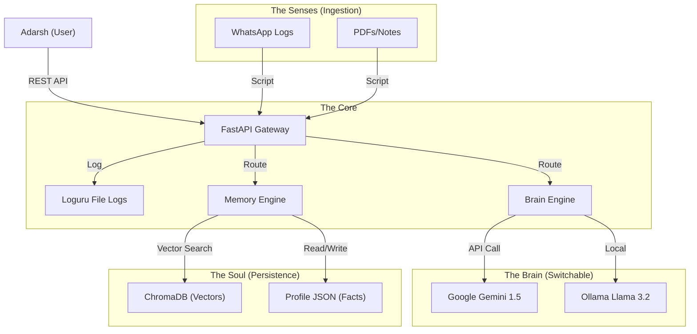

# Product Requirements Document (PRD) - Project D.I.V.A

**Project Name:** D.I.V.A (Digital Intelligent Virtual Assistant) / Project Jarvis: Operation New Year
**Version:** 1.0
**Status:** Draft
**Owner:** Adarsh
**Target Date:** January 1, 2026

## 1. Executive Summary
**Mission:** To build a scalable, memory-persistent, learning AI companion ("The Kid") that serves as a digital extension of the user. Unlike standard chatbots, D.I.V.A is designed to be a "Digital Entity" with a distinct personality, long-term memory, and the ability to execute tasks.

**Philosophy:**
*   **The Brain (Stateless Processor):** Thinks, reasons, and speaks.
*   **The Soul (Stateful Memory):** Remembers facts, vibes, history, and context.
*   **The Hands (Tools):** Executes actions and interacts with the world.

## 2. User Personas
*   **The Operator (Adarsh):** A developer and power user who needs a personalized assistant to manage digital life, recall information, and automate tasks.

## 3. Core Features & Functional Requirements

### 3.1. The Brain (Core Intelligence)
*   **Dual-Model Architecture:**
    *   **Primary (Cloud):** Google Gemini 1.5 Flash for speed and large context (1M tokens).
    *   **Secondary (Local):** Ollama (Llama 3.2) for privacy, offline capability, and cost control.
*   **API Interface:** A robust REST API (FastAPI) to handle requests, route to the appropriate model, and manage responses.

### 3.2. The Soul (Memory & Context)
*   **Vector Memory (RAG):**
    *   **Storage:** ChromaDB (Local).
    *   **Function:** Store and retrieve semantic embeddings of conversations, documents, and chats.
    *   **Retrieval:** Context-aware retrieval before generating responses.
*   **Structured Memory:**
    *   **User Profile:** A dynamic JSON/SQLite store for explicit facts (e.g., "My favorite color is Blue", "I have a meeting on Friday").
    *   **Session Memory:** Short-term context retention for conversational continuity.

### 3.3. The Senses (Data Ingestion)
*   **Multi-Source Ingestion:**
    *   **WhatsApp:** Parser to convert exported chat logs into vector embeddings.
    *   **Files:** Support for PDF, TXT, and Markdown ingestion.
    *   **Web/Notes:** (Future) Ingestion of web clippings and notes.
*   **Automated Pipeline:** Scripts to parse, chunk, embed, and store data automatically.

### 3.4. The Personality ("The Kid")
*   **Adaptive Persona:** System prompts that define a specific character (Jarvis-like).
*   **Context Awareness:** Greetings and tone adapt based on time of day and user history.

### 3.5. The Hands (Tooling & API)
*   **Extensible Tool System:** Architecture to support Python script execution for tasks (e.g., searching the web, file management).
*   **Logging:** Comprehensive structured logging (Loguru) for debugging and "thought process" analysis.

## 4. Technical Architecture

### 4.1. Tech Stack
*   **Language:** Python 3.11+
*   **Framework:** FastAPI (Async, Type-safe)
*   **LLMs:** Google Gemini 1.5 Flash, Ollama (Llama 3.2)
*   **Database:** ChromaDB (Vector), SQLite (Relational/Metadata)
*   **Utilities:** Loguru (Logging), Pydantic (Validation)

### 4.2. System Diagram

## 5. Non-Functional Requirements
*   **Performance:** API response time < 2 seconds for standard queries.
*   **Privacy:** Local-first memory storage; sensitive data stays on the machine (except when using Cloud LLM).
*   **Scalability:** Modular design allowing easy addition of new tools and data sources.
*   **Reliability:** 24/7 uptime goal for the API service.

## 6. Roadmap & Phasing
*   **Phase 1: Skeleton & Brain (Week 1):** Basic API, LLM integration, Logging.
*   **Phase 2: Memory (Week 2):** ChromaDB setup, RAG implementation.
*   **Phase 3: Ingestion (Week 3):** Data loaders for WhatsApp and Files.
*   **Phase 4: Personality (Week 4):** System prompting, User profiling.
*   **Phase 5: Polish & Launch (Week 5):** UI, Stress testing, Deployment.
