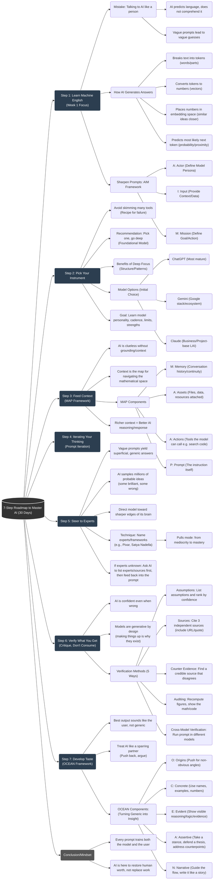

# AI Roadmap

```mermaid
graph LR
    Root[("7-Step Roadmap to Master AI (30 Days)")]

    %% Step 1
    Root --> Step1("Step 1: Learn Machine English<br>(Week 1 Focus)")
    Step1 --> S1_Mistake("Mistake: Talking to AI like a person")
    S1_Mistake --> S1_M1("AI predicts language, does not comprehend it")
    S1_Mistake --> S1_M2("Vague prompts lead to vague guesses")
    
    Step1 --> S1_How("How AI Generates Answers")
    S1_How --> S1_H1("Breaks text into tokens (words/parts)")
    S1_How --> S1_H2("Converts tokens to numbers (vectors)")
    S1_How --> S1_H3("Places numbers in embedding space (similar ideas closer)")
    S1_How --> S1_H4("Predicts most likely next token (probability/proximity)")

    Step1 --> S1_Sharpen("Sharpen Prompts: AIM Framework")
    S1_Sharpen --> S1_AIM_A("A: Actor (Define Model Persona)")
    S1_Sharpen --> S1_AIM_I("I: Input (Provide Context/Data)")
    S1_Sharpen --> S1_AIM_M("M: Mission (Define Goal/Action)")

    %% Step 2
    Root --> Step2("Step 2: Pick Your Instrument")
    Step2 --> S2_Avoid("Avoid skimming many tools<br>(Recipe for failure)")
    Step2 --> S2_Rec("Recommendation: Pick one, go deep<br>(Foundational Model)")
    Step2 --> S2_Ben("Benefits of Deep Focus<br>(Structure/Patterns)")
    
    Step2 --> S2_Models("Model Options (Initial Choice)")
    S2_Models --> S2_GPT("ChatGPT (Most mature)")
    S2_Models --> S2_Gem("Gemini (Google stack/ecosystem)")
    S2_Models --> S2_Claude("Claude (Business/Project-base LAI)")

    Step2 --> S2_Goal("Goal: Learn model personality, cadence, limits, strengths")

    %% Step 3
    Root --> Step3("Step 3: Feed Context<br>(MAP Framework)")
    Step3 --> S3_Clue("AI is clueless without grounding/context")
    Step3 --> S3_Map("Context is the map for navigating the mathematical space")
    
    Step3 --> S3_Comp("MAP Components")
    S3_Comp --> S3_M("M: Memory (Conversation history/continuity)")
    S3_Comp --> S3_A1("A: Assets (Files, data, resources attached)")
    S3_Comp --> S3_A2("A: Actions (Tools the model can call e.g. search code)")
    S3_Comp --> S3_P("P: Prompt (The instruction itself)")

    Step3 --> S3_Rich("Richer context = Better AI reasoning/response")

    %% Step 4
    Root --> Step4("Step 4: Iterating Your Thinking<br>(Prompt Iteration)")
    %% Note: Step 4 in source image appears as a standalone transition milestone without distinct sub-branches visible in the main view, often implying the 'Loop' of applying steps 1-3.

    %% Step 5
    Root --> Step5("Step 5: Steer to Experts")
    Step5 --> S5_Vague("Vague prompts yield superficial, generic answers")
    Step5 --> S5_Sample("AI samples millions of probable ideas<br>(some brilliant, some wrong)")
    Step5 --> S5_Direct("Direct model toward sharper edges of its brain")
    
    Step5 --> S5_Tech("Technique: Name experts/frameworks<br>(e.g., Pixar, Satya Nadella)")
    S5_Tech --> S5_Pull("Pulls mode: from mediocrity to mastery")
    
    Step5 --> S5_Unk("If experts unknown: Ask AI to list experts/sources first,<br>then feed back into the prompt")

    %% Step 6
    Root --> Step6("Step 6: Verify What You Get<br>(Critique, Don't Consume)")
    Step6 --> S6_Conf("AI is confident even when wrong")
    Step6 --> S6_Gen("Models are generative by design<br>(making things up is why they exist)")
    
    Step6 --> S6_Ver("Verification Methods (5 Ways)")
    S6_Ver --> S6_V1("Assumptions: List assumptions and rank by confidence")
    S6_Ver --> S6_V2("Sources: Cite 3 independent sources (include URL/quote)")
    S6_Ver --> S6_V3("Counter Evidence: Find a credible source that disagrees")
    S6_Ver --> S6_V4("Auditing: Recompute figures, show the math/code")
    S6_Ver --> S6_V5("Cross-Model Verification: Run prompt in different models")

    %% Step 7
    Root --> Step7("Step 7: Develop Taste<br>(OCEAN Framework)")
    Step7 --> S7_Best("Best output sounds like the user, not generic")
    Step7 --> S7_Spar("Treat AI like a sparring partner<br>(Push back, argue)")
    
    Step7 --> S7_Ocean("OCEAN Components:<br>(Turning Generic into Insight)")
    S7_Ocean --> S7_O("O: Origins (Push for non-obvious angles)")
    S7_Ocean --> S7_C("C: Concrete (Use names, examples, numbers)")
    S7_Ocean --> S7_E("E: Evident (Show visible reasoning/logic/evidence)")
    S7_Ocean --> S7_A("A: Assertive (Take a stance, defend a thesis, address counterpoints)")
    S7_Ocean --> S7_N("N: Narrative (Guide the flow, write it like a story)")

    %% Conclusion
    Root --> Concl("Conclusion/Mindset")
    Concl --> C_Train("Every prompt trains both the model and the user")
    Concl --> C_Human("AI is here to restore human worth, not replace work")

    %% Styling for readability
    style Root fill:#333,stroke:#fff,stroke-width:2px,color:#fff
    style Step1 fill:#2c3e50,stroke:#fff,color:#fff
    style Step2 fill:#2c3e50,stroke:#fff,color:#fff
    style Step3 fill:#2c3e50,stroke:#fff,color:#fff
    style Step4 fill:#2c3e50,stroke:#fff,color:#fff
    style Step5 fill:#2c3e50,stroke:#fff,color:#fff
    style Step6 fill:#2c3e50,stroke:#fff,color:#fff
    style Step7 fill:#2c3e50,stroke:#fff,color:#fff
    style Concl fill:#555,stroke:#fff,color:#fff
```