# AI Roadmap

```mermaid
graph LR
    Root[("7-Step Roadmap to Master AI (30 Days)")]

    %% Step 1
    Root --> Step1("Step 1: Learn Machine English<br>(Week 1 Focus)")
    Step1 --> S1_Mistake("Mistake: Talking to AI like a person")
    S1_Mistake --> S1_M1("AI predicts language, does not comprehend it")
    S1_Mistake --> S1_M2("Vague prompts lead to vague guesses")
    
    Step1 --> S1_How("How AI Generates Answers")
    S1_How --> S1_H1("Breaks text into tokens (words/parts)")
    S1_How --> S1_H2("Converts tokens to numbers (vectors)")
    S1_How --> S1_H3("Places numbers in embedding space (similar ideas closer)")
    S1_How --> S1_H4("Predicts most likely next token (probability/proximity)")

    Step1 --> S1_Sharpen("Sharpen Prompts: AIM Framework")
    S1_Sharpen --> S1_AIM_A("A: Actor (Define Model Persona)")
    S1_Sharpen --> S1_AIM_I("I: Input (Provide Context/Data)")
    S1_Sharpen --> S1_AIM_M("M: Mission (Define Goal/Action)")

    %% Step 2
    Root --> Step2("Step 2: Pick Your Instrument")
    Step2 --> S2_Avoid("Avoid skimming many tools<br>(Recipe for failure)")
    Step2 --> S2_Rec("Recommendation: Pick one, go deep<br>(Foundational Model)")
    Step2 --> S2_Ben("Benefits of Deep Focus<br>(Structure/Patterns)")
    
    Step2 --> S2_Models("Model Options (Initial Choice)")
    S2_Models --> S2_GPT("ChatGPT (Most mature)")
    S2_Models --> S2_Gem("Gemini (Google stack/ecosystem)")
    S2_Models --> S2_Claude("Claude (Business/Project-base LAI)")

    Step2 --> S2_Goal("Goal: Learn model personality, cadence, limits, strengths")

    %% Step 3
    Root --> Step3("Step 3: Feed Context<br>(MAP Framework)")
    Step3 --> S3_Clue("AI is clueless without grounding/context")
    Step3 --> S3_Map("Context is the map for navigating the mathematical space")
    
    Step3 --> S3_Comp("MAP Components")
    S3_Comp --> S3_M("M: Memory (Conversation history/continuity)")
    S3_Comp --> S3_A1("A: Assets (Files, data, resources attached)")
    S3_Comp --> S3_A2("A: Actions (Tools the model can call e.g. search code)")
    S3_Comp --> S3_P("P: Prompt (The instruction itself)")

    Step3 --> S3_Rich("Richer context = Better AI reasoning/response")

    %% Step 4
    Root --> Step4("Step 4: Iterating Your Thinking<br>(Prompt Iteration)")
    %% Note: Step 4 in source image appears as a standalone transition milestone without distinct sub-branches visible in the main view, often implying the 'Loop' of applying steps 1-3.

    %% Step 5
    Root --> Step5("Step 5: Steer to Experts")
    Step5 --> S5_Vague("Vague prompts yield superficial, generic answers")
    Step5 --> S5_Sample("AI samples millions of probable ideas<br>(some brilliant, some wrong)")
    Step5 --> S5_Direct("Direct model toward sharper edges of its brain")
    
    Step5 --> S5_Tech("Technique: Name experts/frameworks<br>(e.g., Pixar, Satya Nadella)")
    S5_Tech --> S5_Pull("Pulls mode: from mediocrity to mastery")
    
    Step5 --> S5_Unk("If experts unknown: Ask AI to list experts/sources first,<br>then feed back into the prompt")

    %% Step 6
    Root --> Step6("Step 6: Verify What You Get<br>(Critique, Don't Consume)")
    Step6 --> S6_Conf("AI is confident even when wrong")
    Step6 --> S6_Gen("Models are generative by design<br>(making things up is why they exist)")
    
    Step6 --> S6_Ver("Verification Methods (5 Ways)")
    S6_Ver --> S6_V1("Assumptions: List assumptions and rank by confidence")
    S6_Ver --> S6_V2("Sources: Cite 3 independent sources (include URL/quote)")
    S6_Ver --> S6_V3("Counter Evidence: Find a credible source that disagrees")
    S6_Ver --> S6_V4("Auditing: Recompute figures, show the math/code")
    S6_Ver --> S6_V5("Cross-Model Verification: Run prompt in different models")

    %% Step 7
    Root --> Step7("Step 7: Develop Taste<br>(OCEAN Framework)")
    Step7 --> S7_Best("Best output sounds like the user, not generic")
    Step7 --> S7_Spar("Treat AI like a sparring partner<br>(Push back, argue)")
    
    Step7 --> S7_Ocean("OCEAN Components:<br>(Turning Generic into Insight)")
    S7_Ocean --> S7_O("O: Origins (Push for non-obvious angles)")
    S7_Ocean --> S7_C("C: Concrete (Use names, examples, numbers)")
    S7_Ocean --> S7_E("E: Evident (Show visible reasoning/logic/evidence)")
    S7_Ocean --> S7_A("A: Assertive (Take a stance, defend a thesis, address counterpoints)")
    S7_Ocean --> S7_N("N: Narrative (Guide the flow, write it like a story)")

    %% Conclusion
    Root --> Concl("Conclusion/Mindset")
    Concl --> C_Train("Every prompt trains both the model and the user")
    Concl --> C_Human("AI is here to restore human worth, not replace work")

    %% Styling for readability
    style Root fill:#333,stroke:#fff,stroke-width:2px,color:#fff
    style Step1 fill:#2c3e50,stroke:#fff,color:#fff
    style Step2 fill:#2c3e50,stroke:#fff,color:#fff
    style Step3 fill:#2c3e50,stroke:#fff,color:#fff
    style Step4 fill:#2c3e50,stroke:#fff,color:#fff
    style Step5 fill:#2c3e50,stroke:#fff,color:#fff
    style Step6 fill:#2c3e50,stroke:#fff,color:#fff
    style Step7 fill:#2c3e50,stroke:#fff,color:#fff
    style Concl fill:#555,stroke:#fff,color:#fff
```

## Roadmap Graph

## Topics 

* **Large Language Model (LLM)**
* **Tokenization**
* **Next Token Prediction (Probabilistic Generation)**
* **Vectors (The process that creates vectors is called vectorization.)**
* **Embeddings & Embedding Space**
* **Attention**
* **Self-supervised learning**
* **Transformer**
* **Fine tuning**
* **Few shot prompting**
* **Prompt Engineering Frameworks**
    * **AIM (Actor, Input, Mission)**
    * **MAP (Memory, Assets, Actions, Prompt)**
    * **OCEAN (Origins, Concrete, Evident, Assertive, Narrative)**
* **Retrieval Augmented Generation (RAG) (This is also referred to as "rank".)**
* **Vector Database**
* **Model Context Protocol (MCP)**
* **Context Engineering**
* **Context Window**
* **Agents**
* **Function Calling (Tool Use)**
* **Reinforcement Learning**
* **Chain of Thought**
* **Reasoning Model (This is also known as L or M's.)**
* **Multi-model models (or Multimodal models)**
* **Small Language Models (SLMs)**
* **Distillation (This process is used to create distilled models.)**
* **Quantization**
* **Hallucinations**
* **Temperature (Model Parameters)**

## Weekly Timeline

### Day 1: The Fundamentals (What & How)
* [ ] **Large Language Model (LLM)**: Understand the high-level concept.
* [ ] **Tokenization**: Learn how text is broken down.
* [ ] **Next Token Prediction**: Grasp the probabilistic nature of generation.
* [ ] **Temperature**: Experiment with how randomness affects output.
* [ ] **Hallucinations**: Understand why models make things up and how to spot it.

### Day 2: Architecture & Representation (Under the Hood)
* [ ] **Vectors & Vectorization**: Learn how text becomes numbers.
* [ ] **Embeddings & Embedding Space**: Visualize how concepts relate mathematically.
* [ ] **Attention Mechanism**: The key breakthrough allowing context understanding.
* [ ] **Transformer Architecture**: The structure that makes modern AI possible.
* [ ] **Self-supervised Learning**: How models learn from unlabeled data.

### Day 3: Prompt Engineering & Context (Controlling the Model)
* [ ] **Context Window**: Understand the limits of model memory.
* [ ] **Context Engineering**: Techniques to maximize the context window.
* [ ] **Few-Shot Prompting**: Teaching the model with examples.
* [ ] **Prompt Frameworks**: Practice these specific structures:
    * [ ] **AIM** (Actor, Input, Mission)
    * [ ] **MAP** (Memory, Assets, Actions, Prompt)
    * [ ] **OCEAN** (Origins, Concrete, Evident, Assertive, Narrative)

### Day 4: Reasoning & Logic (Thinking Models)
* [ ] **Chain of Thought (CoT)**: Encouraging step-by-step reasoning.
* [ ] **Reasoning Models (o1, etc.)**: Models designed to "think" before answering.
* [ ] **Reinforcement Learning**: How models are rewarded for better answers (RLHF).

### Day 5: Knowledge Retrieval (RAG)
* [ ] **Retrieval Augmented Generation (RAG)**: Connecting LLMs to external data.
* [ ] **Vector Database**: Storing and searching embeddings efficiently.

### Day 6: Agents & Integration (Doing Things)
* [ ] **Agents**: AI systems that can plan and execute tasks.
* [ ] **Function Calling / Tool Use**: How models interact with code/APIs.
* [ ] **Model Context Protocol (MCP)**: Standardizing how AI connects to data.

### Day 7: Optimization & The Future
* [ ] **Fine-Tuning**: Customizing a model for specific tasks.
* [ ] **Small Language Models (SLMs)**: Efficiency and running locally.
* [ ] **Distillation**: Creating smaller models from larger ones.
* [ ] **Quantization**: Reducing model precision for speed/memory.
* [ ] **Multimodal Models**: Working with images, audio, and video.